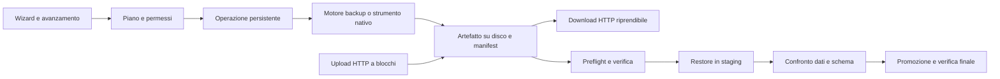

# Piano — Export e import fedeli, selettivi e veloci

Piano per Keus, 16 settembre 2026. Stato: proposta di implementazione basata sul codice attuale e sulle fonti ufficiali. Nessuna funzionalità descritta come futura è già stata realizzata o certificata da questo documento.

## 1. Obiettivo e contratto di prodotto

Un flusso coerente per MongoDB, MySQL e PostgreSQL che permetta di esportare, scaricare, caricare e ripristinare database interi o oggetti selezionati, conservando dati, tipi, schema e dipendenze. Deve funzionare anche quando il dataset supera largamente la RAM del browser e del server.

Le modalità obbligatorie sono:

| Modalità | Struttura | Dati | Utilizzo |
|---|---|---|---|
| Struttura e dati | Tutti gli oggetti selezionati e le dipendenze necessarie | Tutte le righe degli oggetti selezionati | Copia fedele del perimetro scelto |
| Solo struttura | Definizioni, opzioni, indici, vincoli e oggetti programmabili | Nessuna riga/documento | Ambiente vuoto con lo stesso schema |
| Solo dati | Nessuna creazione o modifica implicita dello schema | Tutte le righe degli oggetti selezionati | Caricamento in uno schema esistente compatibile |
| Personalizzata | Selezione per oggetto | Tutti, nessuno oppure filtro esplicito per tabella/collection | Escludere dati voluminosi o sensibili mantenendo la struttura |

«Tutti i dati» significa tutte le righe del perimetro dichiarato, senza limiti della griglia, paginazione visibile o filtri impliciti. Una selezione filtrata è un sottoinsieme dichiarato, mai un backup completo. Il default è struttura e dati, con tutte le entità del database scelto selezionate.

La fedeltà richiesta diventa un contratto verificabile: **nessuna perdita o trasformazione silenziosa; successo solo dopo i controlli previsti; elenco completo delle esclusioni; combinazioni non supportate individuate prima delle scritture**. Non esiste una garanzia universale del 100% contro ogni guasto o ogni futura versione del DBMS. Il rilascio certifica una matrice esplicita di versioni, tipi, oggetti e topologie con prove di ripristino reali.

### Prestazioni: separare i tempi

`T_trasferimento_minimo = byte_effettivamente_trasferiti / banda_effettiva`.

100 GB decimali richiedono almeno 800 secondi su 1 Gbit/s e 80 secondi su 10 Gbit/s, senza overhead. Un TB su 1 Gbit/s richiede almeno circa 2 ore e 13 minuti. Lettura, serializzazione, disco, compressione, costruzione indici e verifica possono costare di più. Questi sono limiti fisici, non benchmark di CodeDB.

L'obiettivo «qualche secondo» si applica all'accettazione del lavoro e all'avvio del download di un artefatto già pronto. Export nuovo e import completo devono puntare a saturare la risorsa disponibile, senza sacrificare integrità. Riutilizzare un artefatto pronto richiede mostrare data e snapshot: non equivale a esportare lo stato attuale. Un incremento può essere piccolo, ma richiede una base verificata e non sostituisce un full autonomo.

## 2. Stato del repository e problemi da risolvere

Riscontri da lettura del codice, non risultati di un nuovo audit o di test eseguiti:

| Componente attuale | Cosa riusare | Limite da affrontare |
|---|---|---|
| `public/js/exportimport.js`, `export-pool.js` | Menu, contesto della connessione fissato all'origine, export parallelo limitato | `lines`, `parts`, stringa finale e `Blob` conservano l'intero export nel browser; richieste separate per schema e pagine non costituiscono una snapshot globale |
| `db/importUploads.js` | Proprietà del caricamento, sequenza, quote e scadenza | Accumula `chunks`, esegue `join` e `JSON.parse`: il trasferimento a blocchi non limita la memoria finale |
| `db/importPlan.js` | Piano immutabile, impronta, barriere, staging, recupero e verifica | Il piano JSON contiene tutti i documenti; hash, normalizzazione e congelamento attraversano l'intero dataset |
| `db/importOperations.js`, `server/eventi-import.js` | Registro operazioni, avanzamento, annullamento, lease, controllo permessi | Stato in `Map`: non basta per recuperare dopo riavvio del processo |
| `backup/lib/engine.js`, `util.js` | File in streaming, gzip, checksum, snapshot SQL e rappresentazioni conservative dei tipi | PostgreSQL senza identità usa `OFFSET`; MongoDB usa un cursore ordinario, senza una snapshot globale in questo percorso; alcuni controlli di identità e conteggi richiedono scansioni aggiuntive |
| `backup/lib/restore.js`, `db/backupRestoreAdapter.js`, `importArtifactAdapter.js` | Preflight, ripristino condiviso, verifica cardinalità, inventario e copie di recupero | Conteggi e identità non provano l'uguaglianza dei valori; promozione MySQL/MongoDB può richiedere backup dello staging e nuova copia completa |
| `db/artefatti.js`, `schemaObjects.js` | Validazione artefatti, sicurezza DDL, confronto oggetti e rimappatura | Estendere copertura e confronto senza confondere normalizzazione testuale con equivalenza semantica |
| Strategie e helper SQL/BSON | Gestione di binari, decimali, interi, geometrie, identificatori | Verificare tutti i percorsi, evitando divergenze tra GUI, backup, export tabella e import |
| `public/js/schema-export.js` | Esportazioni documentali UML/DBML | Lo schema ricostruito per diagrammi non è la fonte di un backup fedele |

Decisione: **evolvere il motore backup/restore e l'orchestratore import già presenti**. Non costruire un secondo motore di serializzazione nella GUI. I formati e i backend nativi entrano nello stesso ciclo di pianificazione, autorizzazione, avanzamento e verifica.

## 3. Interfaccia: riferimenti e flusso proposto

Da HeidiSQL riprendere la selezione esplicita di struttura/dati e oggetti; da DBeaver la distinzione fra trasferimento dati e backup nativo, il mapping e i lavori in background. Fonti: [HeidiSQL](https://www.heidisql.com/help.php), [DBeaver backup/restore](https://dbeaver.com/docs/dbeaver/Backup-Restore/), [DBeaver data transfer](https://dbeaver.com/docs/dbeaver/Data-transfer/). Le scelte seguenti sono la proposta CodeDB.

### Esportazione

1. **Origine:** connessione e database; azione disponibile anche su singola tabella o selezione multipla. PostgreSQL distingue database fisico, schemi e tabelle: l'attuale voce «Database» rappresenta uno schema e non deve esportare accidentalmente schemi omonimi o l'intera istanza.
2. **Contenuto:** modalità globale e albero ricercabile con checkbox a tre stati. Colonne «Struttura» e «Dati» indipendenti, seleziona tutto/nessuno/filtrati, selezione mantenuta durante la ricerca, dimensioni e righe stimate chiaramente etichettate. Su migliaia di oggetti usare rendering progressivo o virtualizzato.
3. **Dipendenze:** mostrare gli oggetti aggiunti automaticamente e il motivo. Una view porta le sue dipendenze; una FK verso una tabella esclusa richiede includerla o dichiararla prerequisito esterno. Nessuna esportazione di oggetti fuori permesso.
4. **Formato e destinazione:** archivio CodeDB verificabile come default; formati nativi per interoperabilità/prestazioni; SQL, CSV ed EJSON come scambio esplicito. Destinazioni: download browser, percorso locale Electron, storage del server; riuso degli alias cloud esistenti se configurati. Nessun percorso server arbitrario dal browser.
5. **Opzioni:** compressione, concorrenza limitata, eventuali filtri parametrizzati e soglia di impatto sulla sorgente. Default sicuri; niente obbligo di scegliere valori tecnici per un export normale.
6. **Riepilogo e avvio:** elenco definitivo, dipendenze, consistenza ottenibile, versioni, spazio stimato, formato, esclusioni e costi di verifica. Il piano viene congelato e identificato da impronta.
7. **Avanzamento:** fasi distinte di preparazione, estrazione, archivio, verifica e download; byte, righe lette, velocità e durata. Percentuale solo se il totale è affidabile, ETA dichiarata come stima. Pulsanti annulla e, dove supportato, riprendi trasferimento.

La modalità solo struttura non scorre i dati e non lancia `COUNT(*)`. Una collection MongoDB vuota conserva validator, opzioni e indici: non si inferisce lo schema da documenti campionati. I valori correnti delle sequence/contatori sono stato dati: con solo struttura usare i valori iniziali dichiarati, con struttura+dati preservarne lo stato quando tecnicamente garantibile.

### Importazione

1. Scegliere file o artefatto esistente; riconoscimento del formato sul contenuto, non solo sull'estensione. Caricamento a disco con progresso e ripresa.
2. Leggere manifest/inventario e selezionare oggetti e contenuti presenti: non si possono richiedere dati assenti dall'archivio. Per SQL plain privo di indice, l'anteprima può richiedere una scansione completa su disco; niente esecuzione per scoprire cosa contiene.
3. Scegliere destinazione e mapping esplicito di database/schema/nomi. Default: nuova destinazione vuota. Evidenziare collisioni, differenze di maiuscole/collation e dipendenze esterne.
4. Scegliere la politica per oggetto: crea se assente; append; merge tramite PK/UNIQUE non nullable; sostituisci oggetti selezionati; sostituisci intero perimetro con recupero. Per dati soli nessuna DDL implicita. Nessun `REPLACE` generico come sinonimo di merge: può cancellare/reinserire e attivare effetti collaterali.
5. Mostrare un'anteprima immutabile delle modifiche, delle eliminazioni, dei conflitti, delle dipendenze, dello spazio necessario, della finestra di fermo e della garanzia di recupero. La conferma distruttiva appartiene al prodotto futuro e si applica a quel piano preciso.
6. Eseguire come lavoro in background. Mostrare artefatto verificato, caricamento, indici/vincoli, verifica dati/schema, promozione, verifica finale. Un errore non viene trasformato in completamento con righe saltate.
7. Consegnare report scaricabile con oggetti, righe, byte, esclusioni, prove eseguite, errori e riferimento alla copia di recupero. Stato «ripristinato dopo errore» distinto da «completato».

Accessibilità: navigazione da tastiera, focus gestito nel wizard, etichette leggibili, progressi annunciati senza spam, stati non affidati al solo colore. Riutilizzare temi, modali e registro operazioni esistenti. Chiudere la finestra o cambiare tab non cambia connessione o destinazione del lavoro.

## 4. Architettura e formati

### Contratto comune

Il piano contiene versione, origine fisica, selezione, modalità per oggetto, filtri, destinazione, formato, backend scelto, dipendenze, politica dei conflitti, consistenza richiesta, capability necessarie e verifica prevista. Contiene **riferimenti a file e digest**, non array di documenti. Il manifest elenca anche versioni DBMS/tool/codec, encoding, timezone, collation, snapshot/topologia, oggetti esclusi e motivo, conteggi, byte, checksum, prerequisiti e ordine di ripristino.

Artefatti immutabili dopo finalizzazione. File temporanei e stato `incompleto` fino a chiusura corretta di tutti i flussi, verifica e pubblicazione atomica del manifest. SHA-256 dei byte effettivi per file/chunk; checksum e confronto dati sono prove diverse. Il checksum non autentica il produttore: un file esterno rimane non fidato.

### Formati da offrire

| Formato | Promessa | Gestione |
|---|---|---|
| Archivio CodeDB versionato | Ripristino verificabile nel motore/versioni certificati | Riutilizzare layout manifest/schema/data del backup; contenitore standard ZIP64, file dati compressi singolarmente e nessuna seconda compressione |
| Nativo PostgreSQL | Copertura del dump nativo e restore selettivo | Directory per parallelismo export; Custom per file nativo singolo; confezionare la directory per il download |
| Nativo MySQL Shell | Dump/load suddiviso e parallelo nelle combinazioni supportate | Conservare metadati e file di avanzamento compatibili con lo strumento |
| Nativo MongoDB | BSON e metadati con garanzie dipendenti dalla topologia | Directory/archivio nativo; definire esplicitamente consistenza e replay |
| SQL plain | Script interoperabile per il dialetto dichiarato | DDL/dati espliciti; parsing streaming e client nativo controllato dove necessario |
| CSV / JSON / EJSON | Interscambio dati; non backup completo dello schema | Mapping, NULL, delimitatori, encoding e tipi dichiarati; avvisi sulle perdite del formato |

ZIP64 richiede una libreria streaming mantenuta se non già disponibile: Node non implementa ZIP nella libreria standard. Verificarne limiti e manutenzione nella fase iniziale; evitare un parser di archivi scritto in casa. Preferire `fs`, `stream.pipeline`, `crypto`, `zlib` e driver già installati per il resto. BSON nativo o EJSON canonico per il percorso fedele MongoDB: il formato relaxed attuale va verificato e non scelto come garanzia di conservazione di tutti i tipi numerici BSON.

Import di `.codedb.json` v1 e backup storici mantenuto con lettore di compatibilità che converte a file/chunk su disco, senza materializzare l'intero documento. Limiti documentati per record singoli enormi. Non inventare metadati mancanti nei vecchi file: etichetta «verifica limitata» e rifiuto della modalità stretta quando la fedeltà non è dimostrabile.

### Motori: criteri di scelta

Il motore incorporato copre le combinazioni certificate senza installazioni esterne; i tool nativi ampliano copertura e prestazioni. Il preflight sceglie un percorso disponibile e lo mostra. Mancanza del tool necessario produce istruzioni concrete per configurarlo oppure un'alternativa con garanzie dichiarate; nessun fallback silenzioso che cambi schema o consistenza.

Eseguire tool con `spawn` e array di argomenti, senza shell; ambiente minimo, file credenziali temporanei protetti e niente password nei log/argomenti. Verificare versioni, exit code e report del tool. Processi e tunnel appartengono al lavoro, con annullamento dell'intero albero; helper Windows senza finestre visibili. Documentare disponibilità/licenze/installazione su Electron Windows/macOS/Linux e container.

## 5. Consistenza della sorgente

| DBMS | Percorso di riferimento | Limiti e trattamento obbligatorio |
|---|---|---|
| PostgreSQL | `pg_dump` o snapshot `REPEATABLE READ` condivisa da tutti i lettori incorporati | Dump parallelo nativo solo Directory; non apre snapshot indipendenti per worker. Gestire lock DDL, timeout, sessioni e durata snapshot. Selezione tabella non chiude automaticamente le dipendenze |
| MySQL InnoDB | Snapshot consistente; MySQL Shell per lettori paralleli coordinati | Una connessione snapshot per worker creata liberamente non dà lo stesso istante. Metadati e DDL richiedono protezioni dedicate; errori di consistency check invalidano l'artefatto |
| MySQL non transazionale | Lock/fermo scritture appropriato | Nessuna promessa di consistenza online tramite sola transazione InnoDB; preflight e finestra esplicita |
| MongoDB replica set | Dump completo con oplog e replay compatibile, oppure percorso snapshot specificamente validato | `--oplog` non supporta selezione DB/collection/query; replay non si combina liberamente con selezione/rimappatura namespace |
| MongoDB standalone/sharded | Fermo scritture coordinato o meccanismo nativo di snapshot/backup supportato dalla topologia | Cursore ordinario e `readConcern: majority` non bastano per una snapshot globale. Per sharding servono coordinamento e copertura dedicati |

Per MongoDB selettivo coerente: supportare prima una finestra senza scritture; per online certificare una strategia snapshot realmente disponibile. Alternativa esplicita: dump completo + replay in ambiente isolato + export selettivo a sorgente ferma, solo con autorizzazioni sull'intero perimetro e spazio sufficiente. Non aggirare RBAC per ottenere una snapshot globale.

Controllare cambiamenti dell'inventario durante l'acquisizione e non basarsi solo sui lock delle tabelle già elencate. Sequence PostgreSQL e altri contatori non sono tutti transazionali come le righe: dichiarare istante/modalità di acquisizione e verificare che il prossimo valore non collida; preservazione esatta dello stato richiede le condizioni appropriate.

Fonti e limiti dei tool: [PostgreSQL pg_dump](https://www.postgresql.org/docs/18/app-pgdump.html), [MySQL Shell dump](https://dev.mysql.com/doc/mysql-shell/26.7/en/mysql-shell-utilities-dump-instance-schema.html), [MongoDB mongodump](https://www.mongodb.com/docs/database-tools/mongodump/).

## 6. Fedeltà: inventario da certificare

### Dati

| Famiglia | Casi minimi di round trip |
|---|---|
| Numeri | BIGINT signed/unsigned ai limiti, DECIMAL/NUMERIC arbitrari, BSON Int32/Int64/Double/Decimal128 distinti, valori speciali ammessi |
| Temporali | Microsecondi, timezone, date senza ora, timestamp con/senza fuso, TIME negativi/estesi MySQL, valori zero ammessi dal sql_mode, infinity PostgreSQL |
| Testo | Unicode, emoji, NUL dove ammesso, newline, escape, stringa vuota distinta da NULL, charset/collation e spazi significativi |
| Binari | Tutti i byte, BLOB/bytea/BIT, BSON Binary con sottotipo e UUID; nessun passaggio distruttivo da stringhe |
| Strutturati | JSON/JSONB, array e limiti dimensionali PostgreSQL, enum/domain/compositi/range; tipi di estensioni inventariati |
| Geometrie | WKB/EWKB o formato nativo conservativo, SRID anche per valore dove consentito, Z/M, vuoto/NULL, geografie, collezioni e coordinate ai limiti |
| BSON | ObjectId, Date, Timestamp, regex/opzioni, MinKey/MaxKey, campi mancanti vs null, array, documenti annidati e ordine significativo dei campi |
| Identità | PK composite, UNIQUE non nullable, tabelle senza chiave con duplicati identici, identity/auto_increment, colonne generate e invisibili |

Non usare `Number` per interi o conteggi non rappresentabili esattamente. Non convertire temporali SQL in `Date` JS prima della serializzazione. Non usare GeoJSON come unico formato di backup geometrico. Colonne generate: conservare l'espressione, non tentare l'inserimento del valore calcolato; verificarne il risultato nel target compatibile.

### Schema e oggetti

Inventariare tabelle/collection vuote, colonne e ordine, tipi e precisione, default/espressioni, nullability, PK/UNIQUE/FK/CHECK, indici con ordine/opzioni/espressioni/predicati, commenti, charset/collation, engine e opzioni. Inoltre:

- PostgreSQL: schemi, sequence/ownership/stato, enum/domain/compositi, funzioni/procedure, trigger, view/materialized view, partizioni/ereditarietà, RLS e policy, owner/ACL/default privileges, estensioni e Large Objects. Oggetti globali come ruoli e tablespace sono prerequisiti o export amministrativo separato, mai implicitamente inclusi in uno schema.
- MySQL: view e `SQL SECURITY`/definer, routine, trigger, eventi, partizioni, indici spaziali/fulltext e opzioni del server necessarie. Non riscrivere silenziosamente definer, collazioni o clausole per rendere il restore eseguibile.
- MongoDB: validator/action/level, collation, capped, time series, clustered collection, indici TTL/partial/sparse/unique/wildcard e ordine delle chiavi, view e pipeline; GridFS come insieme coerente di file/chunk. Sharding e indici di servizi esterni, come Atlas Search, richiedono capability e inventario specifici: se fuori copertura dichiararli come prerequisiti, senza etichetta di copia completa.

Oggetti o tipi sconosciuti sono visibili nel report e bloccano il profilo fedele finché non esiste un percorso verificato. Non basta aggiungerli a una lista di «ignorati». La matrice completa è un deliverable iniziale, mantenuto dai test.

### Selezione, filtri e dipendenze

Costruire un grafo dagli oggetti reali del catalogo, non dalle relazioni euristiche UML. Dipendenze cicliche: creazione in fasi, FK dopo caricamento, validazione finale. Corpi di routine con SQL dinamico possono avere dipendenze non deducibili: dichiararle e richiedere prerequisiti o un perimetro più ampio verificato.

La chiusura dello schema non garantisce la chiusura dei dati: esportare ordini filtrati richiede anche i clienti referenziati. Per filtri offrire «includi righe referenziate» con esplorazione delle FK a insiemi su disco/DB, conteggio stimato dell'espansione e limite esplicito; in alternativa registrare dipendenze dati esterne e verificarle nella destinazione. Niente righe orfane accettate silenziosamente. MongoDB non dichiara FK: i riferimenti applicativi non sono automaticamente ricostruibili.

## 7. Trasferimento e memoria limitata

Socket.IO conserva comandi, permessi e avanzamento; i file passano su endpoint HTTP autenticati dedicati. Riutilizzare controllo Origin/Host, sessione e tenant; un identificatore di operazione non costituisce autorizzazione.

- Export: pipeline sorgente → codec → compressione → hash → file, con backpressure end to end. Nessun array proporzionale alle righe, neppure per deduplicazione, verifica o inventari delle identità: usare scansioni ordinate o ordinamento esterno a memoria limitata.
- Download predefinito: artefatto finalizzato su disco, `Content-Length`, `Content-Disposition`, `ETag` e `Range`/`If-Range`; supportare 206/416 e ripresa dopo interruzione. Download browser gestito nativamente, senza `fetch().blob()` o Base64. Autenticazione tramite sessione appropriata o ticket breve legato all'attore, senza credenziali in URL/log.
- Export diretto durante la generazione: opzione successiva nello stesso piano, con stato «incompleto» fino a manifest finale; niente promessa di ripresa arbitraria su gzip in corso. La via predefinita privilegia file pronti verificati e riprendibili.
- Upload: scrittura incrementale su disco, offset/chunk hash e conferme persistenti. Retry dello stesso chunk idempotente; conflitti di offset/contenuto rifiutati. Limiti per byte compressi, espansi, file, record, ratio di decompressione, tempo e quota tenant.
- Electron: salvataggio diretto nel percorso scelto con dialogo nativo e gli stessi artefatti/verifiche, senza attraversare la memoria del renderer.
- Cloud: riusare `backup/lib/storage.js` e policy; multipart/ripresa ove disponibili, checksum verificati e stesso isolamento. Non introdurre un secondo catalogo incompatibile.

Budget iniziali da validare: incremento RSS del processo server ≤256 MiB per lavoro incorporato; memoria aggiuntiva renderer ≤64 MiB; buffer complessivi proporzionali a worker × batch, indipendenti dalla dimensione del DB. Limiti separati per processi nativi e record singoli. Quota disco comprende upload, artefatto, staging, recupero e temporanei di indici/verifica; l'esaurimento non deve intaccare la destinazione originale.

## 8. Import affidabile, promozione e recupero

Ordine obbligatorio: **validazione completa dell'artefatto → piano e compatibilità → recupero della destinazione quando necessario → staging → dati → oggetti post-caricamento → verifica → promozione → verifica finale → conservazione controllata del recupero**.

Preflight di versioni, spazio, privilegi, prerequisiti, tipi, collation, DDL, checksum e selezione. La destinazione viene ricontrollata prima dell'esecuzione e della promozione: un'anteprima non protegge dalle modifiche concorrenti. Serializzare lavori incompatibili sullo stesso bersaglio e stabilire una finestra senza scritture esterne oppure un meccanismo di sincronizzazione provato. Il lock applicativo CodeDB da solo non ferma altri client.

Caricamento massivo: PostgreSQL `COPY`/`pg_restore`, MySQL Shell `loadDump` o batch vincolati ai byte, MongoDB bulk/BSON; mantenere sicurezza dell'I/O. Una eventuale modalità `LOAD DATA LOCAL` usa solo flussi controllati su connessione dedicata, senza indebolire il gate delle query utente. Non disabilitare globalmente vincoli, trigger o RBAC per guadagnare velocità. Gli oggetti differiti devono essere creati e validati prima del successo; TTL/eventi/job schedulati non devono modificare lo staging prima della verifica.

| Destinazione | Politica di promozione |
|---|---|
| Nuovo database/schema | Pubblicare l'esito solo dopo verifica; nessuna necessità di riscrivere una destinazione esistente |
| PostgreSQL schema esistente | Lo swap di nomi attuale è atomico come DDL, ma dipendenze esterne per OID, grant, search_path e riferimenti testuali possono continuare a puntare ai vecchi oggetti. Abilitarlo solo dopo analisi e prova di tali dipendenze; altrimenti restore transazionale compatibile o finestra di manutenzione con recupero |
| MySQL | `RENAME TABLE` multiplo è utilizzabile solo nelle combinazioni ammesse di tabelle, FK e trigger; nessuno swap universale di database. Altrimenti promozione con fermo scritture e copia/restore verificato, includendone il costo |
| MongoDB | Non esiste uno swap atomico dell'intero database mediante una serie di rename. Usare destinazione nuova o finestra di manutenzione con recupero e prerequisiti della topologia |
| Import selettivo / dati soli | Modificare solo gli oggetti selezionati, preservare e verificare quelli esclusi; transazioni ove applicabili, recupero per il resto. Non promuovere uno schema parziale cancellando gli oggetti non selezionati |

Riutilizzare `eseguiPianoImport` estendendone gli adapter e le garanzie dichiarate. Un rollback che fallisce conserva staging e recupero e termina con «intervento richiesto». Un errore di connessione durante COMMIT/rename ha esito incerto: riconciliare catalogo e journal prima di ritentare. Non dichiarare automaticamente che la destinazione è intatta.

`pg_restore --jobs` non si combina con `--single-transaction`; parallelismo e atomicità si ottengono eventualmente con staging e promozione compatibile, non aggiungendo entrambe le opzioni. [Documentazione pg_restore](https://www.postgresql.org/docs/18/app-pgrestore.html).

### Persistenza e ripresa

Estendere il registro esistente con journal su disco per tenant, aggiornato atomicamente e reso durevole nei punti critici. Registrare piano, artefatto, fase, chunk durabili, staging, recupero e intenzione/esito delle mutazioni. Per più processi serve esclusione sul lavoro; per l'installazione a processo singolo non introdurre una coda distribuita.

La ripresa HTTP recupera byte. La ripresa del restore recupera operazioni già confermate, con ledger e idempotenza provata: mai reinserire alla cieca batch con esito incerto. Il file di progresso nativo MySQL è riusabile ma non equivale a deduplicazione dopo un reset. [MySQL loadDump](https://dev.mysql.com/doc/mysql-shell/26.7/en/mysql-shell-utilities-load-dump.html).

Una snapshot persa non si ricrea continuando dai vecchi chunk: dopo crash dell'export ricominciare l'acquisizione, salvo meccanismo nativo che dimostri la medesima snapshot. Al riavvio riconciliare processi superstiti e stato DB prima di cleanup o resume. Distinguere pausa del trasferimento da pausa del DB: quest'ultima può trattenere lock e snapshot costose.

## 9. Che cosa significa «verificato»

Tre controlli obbligatori nel profilo fedele:

1. **Artefatto:** hash e dimensione di tutti i file, completezza del manifest, nessun chunk mancante/duplicato, sintassi e destinazioni DDL ammesse, versione compatibile.
2. **Schema:** confronto dell'inventario e dei metadati semantici di catalogo, inclusi oggetti post-data, opzioni, stato dei contatori e dipendenze. Normalizzazioni solo se provatamente innocue; ordine delle chiavi degli indici, espressioni e contenuto delle stringhe restano significativi.
3. **Dati:** conteggi e confronto completo del contenuto tipizzato esportato con il target riletto. Digest crittografici canonici per intervalli ordinati da chiave stabile; senza chiave ordinamento esterno delle rappresentazioni di riga con molteplicità preservata. Specificare codec, ordinamento, confini e trattamento di NULL/tipi/valori speciali. Nessun XOR semplice che annulli duplicati.

Calcolare il digest origine durante la lettura della snapshot. Confrontare il target prima di consentire scritture e dopo gli effetti della promozione; se una promozione altera i dati, la verifica precedente non basta. La correttezza del codec si prova con fixture indipendenti e letture native, non solo facendo passare entrambe le parti nello stesso codice potenzialmente difettoso.

Una verifica campionaria può essere un'opzione veloce etichettata «verifica parziale», ma non ottiene «fedeltà completa verificata». Un hash crittografico offre certezza pratica entro le sue ipotesi, non una prova matematica assoluta. Il costo della rilettura completa compare nelle stime e nei benchmark.

## 10. Sicurezza e ciclo di vita

Riutilizzare `artefatti`, policy backup, audit, vault e autorizzazioni esistenti. Controllare tenant, attore, connessione e scope su avvio, stato, upload, download, annullamento, ripresa e cleanup; rivalidare revoche durante i lavori. Non allargare l'attuale import amministrativo prima di disporre di controlli selettivi equivalenti.

Gli strumenti nativi operano fuori dal proxy delle strategie: validare il loro perimetro e credenziali prima dell'avvio. Se un'operazione non è confinabile allo scope autorizzato, richiede il privilegio appropriato; non basta che la GUI mostri poche tabelle.

Un dump esterno può contenere codice SQL attivo: preflight e staging non sono una sandbox di sicurezza. Ripristino su destinazione con privilegi minimi, blocco di comandi host/network e oggetti fuori ambito; per dump nativi opachi o routine non validabili usare un ambiente realmente isolato o un flusso amministrativo esplicito. Nessuna esecuzione automatica di codice per l'anteprima.

Archivi: rifiutare traversal, percorsi assoluti, symlink/hardlink, collisioni Unicode/case-insensitive, nomi duplicati e decompression bomb; risolvere i file tramite ID interni, preservando i nomi originali nel manifest. Proteggere i file temporanei e non salvare segreti nei report. Supportare cifratura autenticata dell'archivio mediante formato/libreria consolidati se richiesta, senza inventare crittografia e mantenendo separate chiavi di backup e vault.

Retention configurata per artefatti e upload incompleti; recuperi con errore mai eliminati automaticamente come normali temporanei. Cleanup di file non in uso, confinato nel tenant e verificabile. Report e audit redatti mantengono decisioni e risultati senza valori sensibili.

## 11. Piano di implementazione e criteri di uscita

Le fasi sono dipendenze operative, non alternative facoltative. Il perimetro finale comprende tutte le modalità e tutti e tre i DBMS.

| Fase | Interventi e file principali | Criterio di uscita |
|---|---|---|
| 0 — Baseline e matrice | Strategie, `backup/lib/*`, helper tipi/schema, test esistenti; inventario versione/topologia/oggetti e baseline prestazioni | Copertura attuale riprodotta, perdite e limiti classificati; dataset e ambiente benchmark fissati; formato contenitore/tool scelti |
| 1 — Piano e selezione | Evolvere `db/importPlan.js`, `artefatti.js`, `schemaObjects.js`; piano export e chiusura dipendenze | Struttura+dati/solo struttura/solo dati/mista generano piani immutabili; esclusioni e target verificati prima delle scritture |
| 2 — Artefatti e trasporto | `backup/lib/util.js`, `db/importUploads.js`, registro operazioni; modulo HTTP dedicato integrato nel server | Export/upload/download a memoria limitata, hash, finalizzazione, Range e ripresa HTTP funzionanti; JSON v1 compatibile |
| 3 — Fedeltà dei motori | `backup/lib/engine.js`, restore e helper condivisi; wrapper nativi minimi | Snapshot valida per ogni profilo, matrice tipi/schema superata; PostgreSQL senza PK senza OFFSET; nessun formato relaxed distruttivo |
| 4 — Restore e recupero | `importPlan`, adapter, `importOperations`, lock e audit | Verifica completa contenuti/schema, import selettivo preserva esclusi, conflitti e crash/rollback gestiti; dipendenze esterne dello swap provate |
| 5 — Wizard completo | `public/js/exportimport.js`, `import-status.js`, integrazione backup manager, modali e temi | Tutte le scelte esposte, anteprima fedele all'esecuzione, progresso non bloccante, test browser/Electron e accessibilità |
| 6 — Prestazioni native | Backend PostgreSQL/MySQL/MongoDB, limiti worker, bulk, compressione e packaging | Concorrenza misurata senza perdere snapshot; confronto con tool nativo a pari garanzie; CPU/RAM/disco entro budget |
| 7 — Certificazione e rilascio | E2E integrità, benchmark riproducibili, README/guida e compatibilità | Tutti i gate seguenti superati, report allegato, vecchi export leggibili, rollback applicativo documentato |

Prima consegna verticale: un export full incorporato generato sul server, scaricato e reimportato in destinazione nuova con verifica completa. Serve a provare l'architettura nelle fasi 1–4; **non chiude il lavoro** senza modalità selettive, GUI, motori e certificazione rimanenti.

## 12. Prove e gate di rilascio

Riutilizzare `npm test`, `test/e2e-dbexport.js`, `test/e2e-integrita-import.js`, E2E backup e test unitari di artefatti/import già presenti. Aggiungere solo prove mancanti della classe di errore; usare l'harness isolato, mai database o vault dell'utente.

| Gate | Prova richiesta |
|---|---|
| Round trip | Ogni DBMS × modalità × tipo/oggetto della matrice; origine → file → nuova destinazione; confronto nativo indipendente di schema e valori |
| Selezione | Tutto/nessuno/misto, oggetti vuoti, FK cicliche/esterne, filtri con chiusura dati, oggetti esclusi invariati, schemi omonimi e nomi quotati |
| Consistenza | Writer concorrenti con invarianti tra tabelle, DDL durante export, snapshot scaduta, MySQL non transazionale, Mongo standalone/replica/sharded nei profili dichiarati |
| Verifica sensibile | Alterare un valore mantenendo conteggio e identità, togliere un indice/validator, cambiare SRID, troncare/duplicare chunk: ogni caso deve fallire |
| Guasti | Disco pieno, rete lenta/interrotta, tool nonzero, kill server nelle fasi critiche, esito COMMIT incerto, errore durante rollback, crash prima/dopo journal |
| Sicurezza | Accesso cross-tenant, revoca permessi, scope nativi, DDL ostile, traversal/link/collisioni archive, decompression bomb e path cleanup |
| Compatibilità | File storici, versioni tool/DB certificati, estensioni mancanti, charset/collation differenti e mapping nomi; nessun downgrade silenzioso |
| GUI | Cambio tab/connessione, chiusura pagina e riconnessione, download/upload interrotti, migliaia di oggetti, tastiera e screen reader |

Per ogni nuovo test di regressione significativo verificare almeno una volta la sensibilità: rompere deliberatamente il comportamento protetto, osservare il fallimento, ripristinare il codice e rieseguire. Mutazioni solo in checkout/dataset isolati e senza lasciarle nel prodotto.

### Benchmark riproducibile

Dataset: 1 GB, 10 GB, 100 GB; prova di durata su 1 TB quando l'ambiente dispone dello spazio richiesto. Includere molte tabelle piccole, una tabella enorme, nessuna PK, BLOB poco comprimibili, documenti grandi, geometrie e indici costosi. Testare dati comprimibili e non comprimibili, rete locale e rete limitata, cache fredda/calda dichiarata.

Registrare hardware, versioni, volumi logici/fisici, compressione, worker, storage, banda/RTT e tutte le fasi. Riportare almeno tre esecuzioni per caso con mediana e variabilità; percentili solo con un numero di campioni adeguato. Misurare anche processi figli, byte letti/scritti aggiuntivi, impatto sulla latenza della sorgente e spazio di recupero.

Obiettivi iniziali da confermare con la baseline:

- Accettazione job entro 2 s p95 sul carico di riferimento, indipendente dal lavoro di catalogo/snapshot che prosegue in background.
- Primo byte di un artefatto pronto entro 2 s p95 sul sistema locale di riferimento; nessuna promessa equivalente per una nuova estrazione.
- Memoria entro i budget della sezione 7 e nessuna crescita lineare passando da 10 a 100 GB.
- Download pronto almeno all'80% del throughput dello stesso server che serve staticamente lo stesso file nelle medesime condizioni.
- Overhead dell'orchestrazione sul percorso nativo entro il 15% misurato a parità di formato, opzioni e verifiche; tempi extra di checksum/rilettura/staging esposti separatamente e inclusi nel totale utente.
- Nessuna regressione di integrità accettata in cambio di throughput. Un benchmark senza indici, recovery o verifica non viene confrontato con un restore che li esegue.

## 13. Decisioni e confini espliciti

Inclusi: export/import full, struttura, dati, selezione e filtri dichiarati; dipendenze; formati CodeDB/nativi/scambio; streaming; recupero; GUI completa; percorsi grandi volumi; compatibilità storica e prove sui tre DBMS.

Non equivalgono a questo piano: replica continua, PITR universale, clone fisico istantaneo e migrazione automatica fra DBMS differenti. Sono progetti distinti: formati, funzioni e semantiche non coincidono. Gli incrementali esistenti restano supportati nel backup, ma non vengono pubblicizzati come CDC affidabile se basati solo su timestamp applicativi o ObjectId.

Ruoli globali, configurazione del server e servizi esterni sono inventariati come prerequisiti o profili amministrativi dedicati; il dump di un database non è il disaster recovery dell'intera infrastruttura. Per ogni oggetto fuori copertura il report dice cosa manca e quale percorso serve a conservarlo.

Il piano è concluso come documento; l'implementazione sarà conclusa soltanto con i gate superati e le misure allegate. Stime di calendario e target assoluti GB/s saranno fissati dopo la baseline, senza inventare prestazioni o durate in assenza dell'ambiente di prova.

## Fonti e tracciabilità

Ricerca dettagliata: [fonti ufficiali e limiti dei tool](ricerca-export-import-fonti.md). Le scelte architetturali, i budget e i gate sono proposte per CodeDB, non funzionalità promesse dai produttori. I riscontri locali della sezione 2 provengono dai file indicati; durante questa attività sono stati letti codice e documentazione, senza eseguire benchmark o prove DB.
